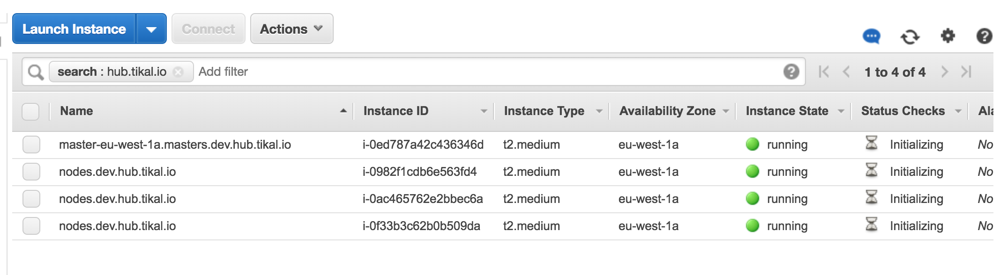

### Generate Terraform config

> Say what ? , why do I need Terraform all of a sudden thought were using kops ...

> Well, the thing is ... we want to use kops to update our cluster but we want to customize it a little out of kops boundaries this is where Terraform comes into play ...


```
mkdir ./modules/clusters \
kops update cluster --name ${KOPS_CLUSTER_NAME} \
  --target=terraform \
  --out=./modules/clusters/${KOPS_CLUSTER_NAME}
```

### Add the module to your `main.tf` file

If you don't have one ;)
Crete one with the following content:

```
cat << EOF > main.tf
module "dev-hub-tikal-io-cluster" {
  source = "./modules/clusters/dev.hub.tikal.io"
}
EOF
```

### Let's run terraform

* `terraform init` should yield:

```
Initializing modules...
- module.dev
Getting source "modules/clusters/dev.hub.tikal.io/"

Initializing provider plugins...
- Checking for available provider plugins on https://releases.hashicorp.com...
- Downloading plugin for provider "aws" (1.19.0)...

The following providers do not have any version constraints in configuration,
so the latest version was installed.

To prevent automatic upgrades to new major versions that may contain breaking
changes, it is recommended to add version = "..." constraints to the
corresponding provider blocks in configuration, with the constraint strings
suggested below.

* provider.aws: version = "~> 1.19"

Terraform has been successfully initialized!

You may now begin working with Terraform. Try running "terraform plan" to see
any changes that are required for your infrastructure. All Terraform commands
should now work.

If you ever set or change modules or backend configuration for Terraform,
rerun this command to reinitialize your working directory. If you forget, other
commands will detect it and remind you to do so if necessary.
```

* `terraform plan` will yield a very long output ... so I will save you the trouble ...

* `terraform apply` will setup the cluster for you - good time to grab a cup of joe and come back in ~5 minuets or so...

If we exmine our ec2 console we should see somthing like the following:

 1 master and 3 nodes in `initializing` state.

### Let's validate our cluster is up and running

`kubectl cluster-info` should yield:

```
kubectl cluster-info
Kubernetes master is running at https://api.dev.hub.tikal.io
KubeDNS is running at https://api.dev.hub.tikal.io/api/v1/namespaces/kube-system/services/kube-dns:dns/proxy

To further debug and diagnose cluster problems, use 'kubectl cluster-info dump'.
```

Which means our cluster is up and running ....

Another reassurance would be ssh to the master server like so -> `ssh -i ~/.ssh/kops_rsa admin@api.dev.hub.tikal.io`

* Troubleshooting ...

  If you get something like:

  ```
  kubectl cluster-info
  Kubernetes master is running at https://api.dev.hub.tikal.io

  To further debug and diagnose cluster problems, use 'kubectl cluster-info dump'.
  Unable to connect to the server: dial tcp: lookup api.dev.hub.tikal.io on 8.8.8.8:53: no such host
  ```

  This could mean 1 of 2 things:
  1. Some issue with your route53 zone and kops (well Terraform) was unable to do it for you ...
  2. Pervious `kubectl cluster-info` had your local DNS cache from resolving so either wait / flush dns an retry ...
